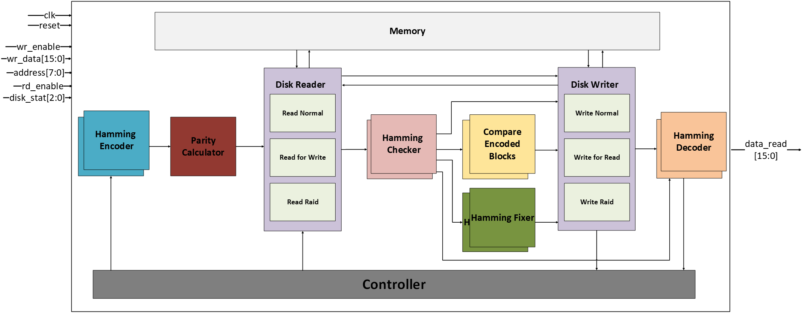

# Hamming ECC in SSD RAID

A hardware-level project that combines **Hamming Error Correction Code (ECC)** with **RAID 5** to improve data integrity, reliability, and storage efficiency in SSD-based systems.

## Table of Contents
- [Overview](#overview)
- [System Features](#system-features)
- [Architecture](#architecture)
- [Simulation Results](#simulation-results)
- [Development](#development)
- [Contributors](#contributors)

## Overview
This project implements a hybrid storage system that integrates **RAID 5 parity** and **Hamming (12,8) ECC** to detect and correct single-bit errors (SBE) and recover data from single disk failures. The goal is to enhance data reliability system performance.

### Key Technologies
- **RAID 5**: Data striping with distributed parity for disk failure recovery.
- **Hamming (12,8) ECC**: Single-bit error correction using 4 parity bits per 8 data bits.
- **VHDL/Verilog**: SystemVerilog implementation.
- **Python**: Simulation and validation of the algorithm's logic and efficiency.

## System Features
| Feature                          | RAID 5 Only | Hamming Only | RAID 5 + Hamming |
|----------------------------------|-------------|---------------|------------------|
| Redundancy                       | ✅           | ❌            | ✅                |
| Single Disk Failure Recovery     | ✅           | ❌            | ✅                |
| Single Bit Error Correction      | ❌           | ✅            | ✅                |
| Double Bit Error Detection       | ❌           | ✅ (detect)    | ✅ (detect)      |
| Write Optimization (Wear Leveling) | Medium      | Low           | High             |
| Storage Overhead                 | 33%         | 33%           | 55.55%           |
| Data Utilization Efficiency      | 66%         | 66%           | 44.44%           |

## Systems Comparison Table

The table below summarizes the tradeoffs between different configurations:

|                              | Without RAID 5 and Hamming (12,8) | Hamming (12,8) only | RAID 5 only | RAID 5 + Hamming (12,8) |
|------------------------------|------------------------------------|---------------------|--------------|--------------------------|
| **Overhead**                | 0%                                | 33%                | 33%         | 55.55%                  |
| **Efficiency**              | 100%                              | 66%                | 66%         | 44.44%                  |
| **Recovery Capability**     | No recovery capability             | Single-bit error correction only | Single disk failure recovery | Single disk failure recovery + Single-bit error correction |
| **Wear Leveling**           | Depends on system                  | Good               | Good        | Very good               |

## Micro-Architecture
The system is composed of the following components:
- **Hamming Encoder/Checker/Fixer/Decoder**
- **Parity Calculator**
- **Disk Writer/Reader Modules**
- **Controller**
- **RAID 5 Recovery FSM**

Micro-Architecture diagrams and detailed module descriptions are available in the full report.

## Simulation Results
- **Reduced Read/Write Operations**: Integrating Hamming ECC significantly reduces unnecessary disk accesses during error correction.
- **Improved Wear Leveling**: Balanced write operations across disks extend SSD lifespan.
- **Performance Metrics**: Verified via synthesis—area, speed, and power efficiency.

## Development
- **Language**: Verilog, SystemVerilog for hardware; Python for algorithm simulation, bash for scripting.
- **Tools**: Cadence: Innovus. Synopsys: Verdi, Design Vision, Quartus/Vivado, Python 3.x

## Contributors
- Eliraz Kadosh 
- Eliram Amrusi

### Eliraz Kadosh
- [GitHub](https://github.com/elirazkadosh)
- [LinkedIn](https://www.linkedin.com/in/eliraz-kadosh)

### Eliram Amrusi
- [GitHub](https://github.com/eliramamrusi)
- [LinkedIn](https://www.linkedin.com/in/eliram-amrusi-11b949258)

Supervisor: Dr. Amit Berman  
Institution: Technion – Israel Institute of Technology, Faculty of Electrical and Computer Engineering
